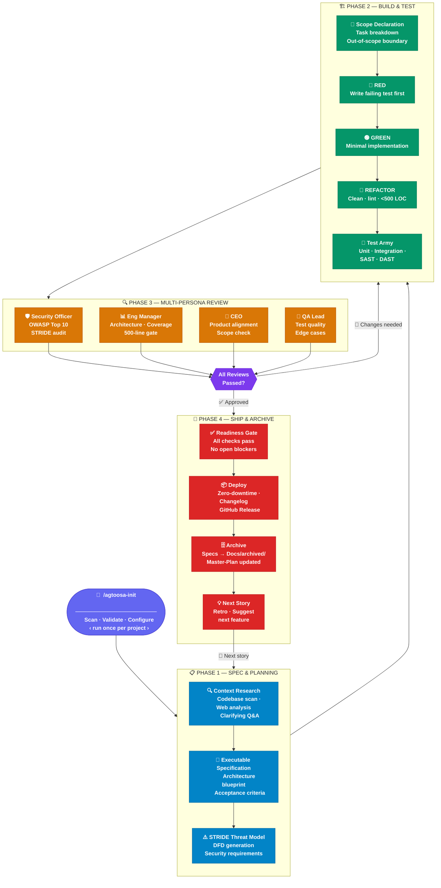

<div align="center">

# 🤖 AgToosa

**The Spec-Driven Agentic AI Framework for Software Development**

[](LICENSE)
[](https://github.com/sky2464/AgToosa/releases)
[](https://github.com/sky2464/AgToosa/actions/workflows/ci.yml)
[](https://github.com/sky2464/AgToosa/actions/workflows/security-scan.yml)
[](https://github.com/sky2464/AgToosa/actions/workflows/release.yml)
[](CONTRIBUTING.md)
[](https://github.com/sky2464/AgToosa/discussions)

*Turn your AI coding assistant into an autonomous, security-first development team.*

**Public launch status:** AgToosa is public. The repository, release tag, raw bootstrap files, registry index, Homebrew tap, support links, and proof project are anonymously accessible.

**Public launch: pinned release**

```bash
bash <(curl -fsSL https://raw.githubusercontent.com/sky2464/AgToosa/main/bootstrap.sh) --ref v5.3.0
```

**Private collaborator path: clone and run**

```bash
git clone https://github.com/sky2464/AgToosa.git && cd AgToosa && bash agtoosa.sh
```

See the [first 15 minutes proof](docs/examples/first-15-minutes.md) for a clean-repo walkthrough that shows generated workflow files and expected spec/test-plan/review/ship-check artifacts. The public proof repository is [sky2464/agtoosa-first-15-proof](https://github.com/sky2464/agtoosa-first-15-proof).

Before public announcement or a future release, run the [public launch proof checklist](docs/examples/public-launch-proof.md) and keep public-facing claims tied to passing checks.

For teams evaluating assurance boundaries, see the [team trust roadmap](docs/AgToosa_Team_Trust_Roadmap.md).

</div>

---

## Installation

### System Requirements

AgToosa requires these tools (all present by default on modern macOS/Linux):
- **bash** 4.0+
- **git** (any recent version)
- **curl** (any recent version)
- **tar** (any recent version)
- **jq** 1.6+ — strongly recommended; required for all `--registry` commands (list, search, info, install, publish)

If any are missing, the bootstrap script will tell you how to install them. Install `jq` via `brew install jq` (macOS) or `sudo apt-get install jq` (Debian/Ubuntu).

### Quick Start

**macOS & Linux:**

```bash
# Public launch: pinned release.
bash <(curl -fsSL https://raw.githubusercontent.com/sky2464/AgToosa/main/bootstrap.sh) --ref v5.3.0

# Persistent install via Homebrew (formula pinned to the tagged release tarball)
brew install sky2464/agtoosa/agtoosa

# npm wrapper (downloads the release pinned to the package version)
npx agtoosa

# Non-interactive (CI, devcontainers, scripted rollouts)
bash agtoosa.sh --path /path/to/project --platforms cursor,claude --yes

# Manual verification path for local source checkouts:
git clone https://github.com/sky2464/AgToosa.git
cd AgToosa
bash agtoosa.sh --version

# development-only main branch command; may include unreleased changes
bash <(curl -fsSL https://raw.githubusercontent.com/sky2464/AgToosa/main/bootstrap.sh)
```

> **Pinned installs fail closed.** `--ref vX.Y.Z` never silently falls back to a branch. Each release publishes `bootstrap.sh` and a `SHA256SUMS` asset — verify with `--sha256 <hex>` for high-assurance installs.

**Day 1 (after install):** open your AI assistant and run five commands — `/agtoosa-init` (once) → `/agtoosa-spec` → `/agtoosa-build` → `/agtoosa-review` → `/agtoosa-ship`. Everything else is optional utilities.

**Windows (native):**

```powershell
# Public launch: pinned release.
$Ref = "v5.3.0"
iwr -UseBasicParsing https://raw.githubusercontent.com/sky2464/AgToosa/main/bootstrap.ps1 | iex
.\agtoosa.ps1 -Version

# Manual verification path for local source checkouts
git clone https://github.com/sky2464/AgToosa.git
cd AgToosa
.\agtoosa.ps1 -Version
```

**Windows (WSL2 alternative):**
1. [Set up WSL2 on Windows](https://docs.microsoft.com/en-us/windows/wsl/install)
2. Open your WSL2 terminal and run the macOS/Linux command above

> **Note:** Windows native installation requires Git for Windows. Both native and WSL2 paths are fully supported.

### Platform Notes

| Platform | Generator | Registry list/search/info | Registry install | Registry publish | Smart merge |
|----------|-----------|--------------------------|-----------------|-----------------|-------------|
| macOS / Linux (bash) | ✅ Full | ✅ (requires `jq`) | ✅ | ✅ | ✅ |
| Windows native (PowerShell) | ✅ Full | ✅ | ✅ | ❌ Not supported | ✅ |
| Windows WSL2 | ✅ Full | ✅ (requires `jq`) | ✅ | ✅ | ✅ |

> **Windows tip:** For full feature parity including `--registry publish`, use WSL2 or Git Bash instead of native PowerShell.
> Windows tip: For full feature parity including registry publish, use WSL2 or Git Bash instead of native PowerShell.

**Or clone and run:**
```bash
git clone https://github.com/sky2464/AgToosa.git && cd AgToosa && bash agtoosa.sh
```

### Troubleshooting

If you see an error like `Missing: curl`, the bootstrap script will print installation instructions for your OS. Follow them and try again.

For more help, open a [discussion](https://github.com/sky2464/AgToosa/discussions) or [issue](https://github.com/sky2464/AgToosa/issues).

---

## What is AgToosa?

AgToosa is a **framework of markdown instructions** that transforms any AI coding assistant into a structured, spec-driven development team. Run the local generator, tell it your project path, and your AI assistant gains a complete Software Development Lifecycle — from research and planning to building, testing, reviewing, and shipping.

**No target-app runtime. No SDK to link.** AgToosa installs markdown workflows and platform adapters into your repo. **Generator prerequisites:** the installer uses standard CLI tools such as Bash or PowerShell, Git, curl/web requests, tar, and jq for registry commands.

### Key Principles

- 🔒 **Security by Design** — STRIDE threat modeling, SBOM/SAST/DAST guidance in build and review workflows (your AI runs the checks; AgToosa does not execute them)
- 📋 **Spec-Driven** — Every feature starts with research, a formal specification, and an architectural plan
- 🧪 **Test-Driven Development** — Red-Green-Refactor cycle instructed during `/agtoosa-build`
- 🧠 **Context-Aware** — `Docs/Master-Plan.md` is the project-management source of truth (replaces Linear, Jira, GitHub Projects, and similar trackers)
- 🔄 **4-Phase Lifecycle** — Spec → Build → Review → Ship (after a one-time `/agtoosa-init` setup)
- 🛡️ **Observable** — OpenTelemetry-style hooks are workflow guidance when your stack supports them

---

## Architecture

AgToosa organizes development into **4 core phases**, executed via slash commands. Every feature follows the same lifecycle — from research to deployment — with mandatory review gates and a continuous loop back to the next story.



| Phase | Command | What It Does |
|-------|---------|-------------|
| **0. Setup** | `/agtoosa-init` | **One-time:** Scan codebase, validate AI configs, establish context |
| **1. Spec & Planning** | `/agtoosa-spec` | Research, specify, architect, STRIDE threat model, and atomic task planning. Generated spec files follow the format defined in `Docs/SPEC-FORMAT.md` (EARS acceptance criteria, hierarchical task tree, and Wave Plan). |
| **2. Build & Test** | `/agtoosa-build` | TDD Red-Green-Refactor against the planned task list → full test army |
| **3. Multi-Persona Review** | `/agtoosa-review` | Security · Architecture · Product · QA review gate |
| **4. Ship & Cleanup** | `/agtoosa-ship` | Deploy, archive, changelog, suggest next story |

---

## Command Reference

### Core Commands

| Command | Description |
|---------|-------------|
| `/agtoosa-init` | **One-time setup.** Scan codebase, validate AI config files, generate context files, configure TDD preferences |
| `/agtoosa-spec` | Research and create an **Executable Specification** with embedded architectural plan, STRIDE threat modeling, and atomic task breakdown |
| `/agtoosa-build` | Implement the planned task list with **TDD Red-Green-Refactor** and run the full test suite with SAST/DAST |
| `/agtoosa-review` | Multi-persona review (Security Officer, Eng Manager, CEO, QA Lead) + code simplification |
| `/agtoosa-ship` | **Zero-downtime deployment**, archive specs to `Docs/archived/`, update changelog, suggest next story |

### Optional Utility

| Command | Description |
|---------|-------------|
| `/agtoosa-goal` | Clarify project or story outcomes into a Goal Contract before spec/build/review/ship work depends on them |
| `/agtoosa-revert` | **Git-aware logical rollback** by phase/task. Most modern AI tools have built-in checkpoints — use this when you need deeper rollback control. |

---

## More Install Options & Flags

All install paths are documented in [Installation](#installation) above. Additional notes:

- **Homebrew lifecycle:** `brew upgrade agtoosa` to update; `agtoosa --version` to verify. The formula is pinned to the tagged release tarball with a sha256.
- **Bootstrap pass-through:** add `--` before generator flags: `bash <(curl -fsSL https://raw.githubusercontent.com/sky2464/AgToosa/main/bootstrap.sh) --ref vX.Y.Z -- --dry-run`
- **Git Bash / WSL (Windows):** `bash <(curl -fsSL https://raw.githubusercontent.com/sky2464/AgToosa/main/bootstrap.sh) --ref vX.Y.Z`
- **Native PowerShell:** clone the repo and run `./agtoosa.ps1`

### Flags

```bash
bash agtoosa.sh --path <dir> --platforms cursor,claude --yes   # Non-interactive install
bash agtoosa.sh --update /path/to/project   # Update an existing install
bash agtoosa.sh --verify /path/to/project   # Deterministic lifecycle verification (read-only, no AI)
bash agtoosa.sh --doctor /path/to/project   # Diagnose install health, version skew, wiring
bash agtoosa.sh --uninstall /path/to/project # Clean removal (keeps Master-Plan, Context, archived)
bash agtoosa.sh --force     # Overwrite existing files (creates .bak backups)
bash agtoosa.sh --dry-run   # Preview without writing
bash agtoosa.sh --allow-unverified  # Permit unverified registry packs (off by default)
bash agtoosa.sh --version   # Print version
bash agtoosa.sh --help      # Show help
```

---

## Quick Start

1. **Run** `bash agtoosa.sh` and enter your project path
2. **Select** your AI assistant(s) — only necessary config files are generated
3. **Open** your AI assistant (Cursor, Windsurf, Claude Code, Gemini CLI, etc.)
4. **Run** `/agtoosa-init` to set up your project (one-time)
5. **Run** `/agtoosa-spec Create a user authentication system` to start building!

The AI will guide you through each phase — asking one goal-aware question at a time when intent is unclear, researching best practices, and generating specifications before writing a single line of code.

---

## Verification — Trust, but Verify

AgToosa is the only multi-assistant SDD framework that ships a **deterministic, no-AI verifier** with every install:

```bash
bash Docs/agtoosa-verify.sh            # context, spec approval, EARS ACs, AC→test mapping, threat model, TDD evidence
bash Docs/agtoosa-verify.sh --strict   # warnings fail too
bash Docs/agtoosa-verify.sh stats      # cycle analytics from your Master-Plan and phase events
```

Copy `Docs/agtoosa-gate.yml.example` to `.github/workflows/agtoosa-gate.yml` and the same checks **block PRs in CI** — converting agent-instructed discipline into machine-enforced gates. See the [enforcement boundary comparison](docs/enforcement-comparison.md) for how this stacks up against other SDD frameworks, and [docs/benchmarks/](docs/benchmarks/README.md) for the reproducible benchmark suite.

---

## Smart Init (`/agtoosa-init`)

The init command is intelligent — it doesn't just scaffold files, it validates your entire AI setup:

- **Detects** existing AI config files (`.cursorrules`, `CLAUDE.md`, `AGENTS.md`, etc.)
- **Validates** that each config is correctly wired to AgToosa's workflow
- **Creates** any missing config files for your selected AI tool(s)
- **Understands** that different platforms have different init mechanisms (Cursor auto-loads `.cursorrules`, Claude Code auto-loads `CLAUDE.md`, etc.)
- **Clarifies** the project Goal Contract in `Docs/Master-Plan.md` before epics and specs depend on it
- **Configures** TDD preferences, test framework detection, and project context

---

## TDD Enforcement

AgToosa integrates Test-Driven Development principles directly into its workflow:

| TDD Phase | What Happens | When |
|-----------|-------------|------|
| 🔴 **RED** | Write a failing test that describes expected behavior | Before ANY implementation |
| 🟢 **GREEN** | Write minimal code to make the test pass | After test is written |
| 🔵 **REFACTOR** | Clean up, lint, ensure <500 LOC per file | After test passes |

TDD is configured during `/agtoosa-init` and enforced during every `/agtoosa-build` cycle. This ensures no implementation code is written without a corresponding test.

---

## Security Features

AgToosa **instructs** your AI assistant to apply these practices. The generator does not run scans or sandboxes itself. See `template/Docs/AgToosa_Readiness.md` for the full workflow-vs-enforcement matrix.

| Feature | Phase | Workflow guidance | Generator enforces |
|---------|-------|-------------------|-------------------|
| **STRIDE Threat Modeling** | `/agtoosa-spec` | DFD and threat analysis before code | No |
| **Sandboxed Execution** | `/agtoosa-build` | Ephemeral Docker/Firecracker when applicable | No |
| **SBOM Generation** | `/agtoosa-build` | Software Bill of Materials and dependency audit | No |
| **SAST/DAST Scanning** | `/agtoosa-build` `/agtoosa-review` | Semgrep, CodeQL, Gitleaks when installed | No |
| **IaC Scanning** | `/agtoosa-build` | Checkov/tfsec for cloud infrastructure | No |
| **PII Redaction** | Always | Scrub sensitive data before LLM context | No |
| **Prompt Injection Guard** | Always | Sanitize inputs from untrusted sources | No |
| **Initial readiness gates** | `/agtoosa-status readiness` | Context, spec, tests, threat model, task tree | No |
| **Deterministic lifecycle verifier** | `Docs/agtoosa-verify.sh` (local + CI gate) | Spec approval, EARS lint, AC→test mapping, threat model, TDD evidence presence | Yes — machine-checked script, no AI involved |
| **Registry pack containment** | `--registry install` | SHA-256 pin, safe extraction, verified-flag enforcement, content preview, hook/CI destination denylist | Yes |
| **Template file install** | `agtoosa.sh` | Copies registered workflow docs to your project | Yes |

---

## Supported AI Platforms

AgToosa works with any AI coding assistant. The generator creates only the configs you need:

| Platform | Config Files | Selection |
|----------|-------------|-----------|
| **Cursor** | `.cursorrules`, `.cursor/rules/`, `.cursor/commands/` | Option 1 |
| **Windsurf** | `.windsurfrules`, `.windsurf/rules/`, `.windsurf/workflows/` | Option 2 |
| **Claude Code** | `CLAUDE.md` | Option 3 |
| **Gemini CLI / Jules** | `AGENTS.md` | Option 4 |
| **GitHub Copilot** | `.github/copilot-instructions.md` | Option 5 |
| **Codex / OpenCode / Other** | `OPENCODE.md`, `.codex/skills/`, `Docs/AgToosa_Agent.md` | Option 7 |
| **Any other AI** | `Docs/AgToosa_Agent.md` | Always included |

> `/agtoosa-init` will also detect and validate any existing AI config files in your project.

---

## Project Structure

After running `agtoosa.sh`, your project will have:

```
your-project/
├── .cursorrules              # AI entry point (Cursor) — if selected
├── .cursor/
│   ├── commands/             # Native Cursor /agtoosa-* commands — if selected
│   └── rules/                # Cursor context rules — if selected
├── .windsurfrules            # AI entry point (Windsurf) — if selected
├── .windsurf/
│   ├── workflows/            # Native Windsurf /agtoosa-* workflows — if selected
│   └── rules/                # Windsurf context rules — if selected
├── AGENTS.md                 # AI entry point (Gemini CLI) — if selected
├── CLAUDE.md                 # AI entry point (Claude Code) — if selected
├── .codex/
│   └── skills/               # Codex AgToosa workflow skills — if option 7/all selected
├── .github/
│   └── copilot-instructions.md  # AI entry point (Copilot) — if selected
└── Docs/
    ├── AgToosa_Agent.md    # Core instructions & command reference
    ├── AgToosa_Quickref.md # One-page command + rules quickref (cheapest context entry)
    ├── agtoosa-verify.sh   # Deterministic lifecycle verifier (no AI; run locally or in CI)
    ├── agtoosa-gate.yml.example  # Copy to .github/workflows/ to gate PRs on the verifier
    ├── AgToosa_Init.md     # /agtoosa-init workflow
    ├── AgToosa_Spec.md     # /agtoosa-spec workflow
    ├── AgToosa_Build.md    # /agtoosa-build workflow (TDD + testing)
    ├── AgToosa_Review.md   # /agtoosa-review workflow
    ├── AgToosa_Ship.md     # /agtoosa-ship workflow
    ├── AgToosa_Goal.md     # /agtoosa-goal utility/sub-workflow
    ├── AgToosa_Revert.md   # /agtoosa-revert (optional utility)
    ├── AgToosa_Skills.md   # Subagent skill mapping
    ├── AgToosa_Claude.md   # Claude-specific config
    ├── AgToosa_Gemini.md   # Gemini-specific config
    ├── CONTEXT-FORMAT.md     # Context file format reference
    ├── ADR-FORMAT.md         # ADR format reference
    ├── SPEC-FORMAT.md        # Single-file spec format reference (EARS ACs, task tree, Wave Plan)
    ├── Master-Plan.md        # Source of truth for project state and backlog
    ├── AgToosa_Readiness.md  # Initial readiness checklist and promise-to-proof matrix
    ├── AgToosa_Changelog.md    # Auto-maintained changelog
    ├── Context/              # Project context (created by /agtoosa-init)
    └── archived/             # Completed specs & plans
```

---

## How It Differs

Comparison last reviewed: 2026-06-07.

### Use AgToosa when

- You are a solo or indie developer using multiple AI coding assistants and want one repo-native SDLC workflow contract.
- You want specs, test-plan mapping, review, and ship discipline without adding a target-app SDK or hosted service.
- You prefer markdown workflows and platform adapters over a heavier runtime, MCP server, task database, or IDE-specific system.

### Use another tool when

- Use **GitHub Spec Kit** when you want the largest ecosystem, organizational catalogs, presets, and first-party GitHub-scale integrations.
- Use **OpenSpec** when brownfield current-state specs and change-delta modeling are the primary need.
- Use **BMAD-METHOD** when you want a mature role/agent ecosystem with many specialized workflows.
- Use **Task Master** when active task execution, task dependencies, and MCP/editor task management are more important than repo-local workflow files.
- Use **Spec Kitty** when worktree orchestration, missions, and agent work packages are the main value.
- Use **metaswarm** when you want deeper multi-agent orchestration and are comfortable adopting a more opinionated system.

AgToosa's wedge is narrower: lightweight, repo-native, multi-assistant workflow installation for developers who want stronger launch discipline than ad-hoc prompts.

### Competitive execution wave

DEV-042 through DEV-060 are roadmap specs, not current guarantees. The Competitive execution wave targets repo-native proof gates that alternatives often handle through heavier runtimes, hosted task systems, or single-IDE workflows: spec quality analysis, brownfield drift baselines, EARS-to-test TDD evidence, async agent handoff/import, an evidence ledger, governance policy, signed registry provenance, and benchmark proof.

Until each linked story ships, these remain planned controls. AgToosa's current guarantee stays narrower: repo-native proof gates and multi-assistant workflow files with explicit generator-enforced, CI-enforced, agent-instructed, manual, or roadmap boundaries.

---

## GitHub Automation & Workflow

AgToosa ships with comprehensive GitHub automation to keep your project healthy and contributors engaged:

### Automated Workflows

| Workflow | Purpose | Trigger |
|----------|---------|---------|
| **Semantic Release** | Auto-publish releases from git tags with changelog extraction | `git tag v*` |
| **Stale Issues** | Auto-close inactive issues after 30 days | Daily schedule |
| **Auto-Label** | Automatically label issues and PRs by keywords | Issue/PR opened |
| **Security Scan** | SAST, dependency vulnerabilities, secret scanning | Push to main, weekly schedule |
| **Wiki Sync** | Keep GitHub Wiki in sync with `template/Docs/` | Push to main |
| **Contributor Welcome** | Greet first-time contributors, suggest good-first-issues | PR/Issue opened |
| **Project Auto-Assign** | Assign new issues to GitHub Project backlog | Issue opened |
| **Dependabot** | Automated dependency updates for Actions and tools | Weekly |

### Community Features

- **Discussions** — Q&A, Ideas, Show & Tell categories for community engagement
- **GitHub Projects** — Optional public board; `Docs/Master-Plan.md` remains the AgToosa source of truth
- **Issue Templates** — Structured bug/feature forms (`.github/ISSUE_TEMPLATE/`)
- **Discussion Templates** — Q&A, Ideas, Show & Tell templates (`.github/discussion_templates/`)

### Release Management

- **Semantic Versioning** — Enforced tag format validation
- **CHANGELOG Extraction** — Release notes automatically extracted from CHANGELOG.md
- **Milestone Auto-Creation** — Next version milestone created automatically
- **Pre-release Support** — `prerelease` flag for release candidates

---

## Contributing

We welcome contributions! Please see [CONTRIBUTING.md](CONTRIBUTING.md) for guidelines.

## Security

For security concerns, please see our [Security Policy](SECURITY.md).

## License

MIT License — see [LICENSE](LICENSE) for details.

---

<div align="center">

**Built with ❤️ for the agentic AI era.**

[Report Bug](https://github.com/sky2464/AgToosa/issues) · [Request Feature](https://github.com/sky2464/AgToosa/issues) · [Discussions](https://github.com/sky2464/AgToosa/discussions)

</div>
