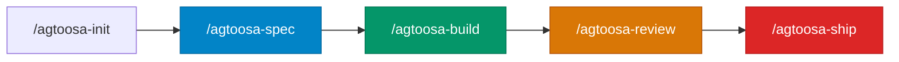

<div align="center">

# AgToosa

**The repo-native AI project manager for spec-driven development**

[](LICENSE)
[](https://github.com/sky2464/AgToosa/releases)
[](https://github.com/sky2464/AgToosa/actions/workflows/ci.yml)
[](.github/CONTRIBUTING.md)
[](https://github.com/sky2464/AgToosa/discussions)

</div>

## Quick install

**macOS / Linux**

```bash
curl -fsSL https://raw.githubusercontent.com/sky2464/AgToosa/main/bootstrap.sh | bash -s -- --ref v5.3.62
```

**Windows (PowerShell)** — requires [Git for Windows](https://git-scm.com/download/win) (provides Git Bash)

```powershell
$Ref = "v5.3.62"
$BootstrapPath = Join-Path $env:TEMP "agtoosa-bootstrap.ps1"
Invoke-WebRequest -Uri "https://raw.githubusercontent.com/sky2464/AgToosa/$Ref/bootstrap.ps1" -OutFile $BootstrapPath -UseBasicParsing
& $BootstrapPath -Ref $Ref
```

When the generator starts, enter your project path at the prompt (or `cd` into your repo first). Then open your AI assistant: `/agtoosa-init` once → `/agtoosa-next` repeatedly.
[Full install matrix, flags, and troubleshooting →](docs/guides/readme-reference.md)

### What lands in your repo

AgToosa only ever writes a `Docs/` folder plus your chosen AI platform's config into the *target* project you point it at — this repository is the generator's own source, none of it is copied into your codebase.

```
your-project/
├── Docs/              # workflow docs, deterministic verifier, generated specs
└── .claude/ .cursor/  # (or whichever platform(s) you selected)
```

## See it in action



```mermaid
flowchart LR
    classDef spec fill:#0284c7,stroke:#0369a1,color:#fff
    classDef build fill:#059669,stroke:#047857,color:#fff
    classDef review fill:#d97706,stroke:#b45309,color:#fff
    classDef ship fill:#dc2626,stroke:#b91c1c,color:#fff
    INIT["/agtoosa-init"] --> S["/agtoosa-spec"] --> B["/agtoosa-build"] --> R["/agtoosa-review"] --> SH["/agtoosa-ship"]
    class S spec
    class B build
    class R review
    class SH ship
```


[Full architecture diagram →](docs/guides/architecture-overview.md) · [First 15 minutes walkthrough](docs/examples/first-15-minutes.md) · proof video `[manual]`

## Essentials

- **Spec first** — research, architecture, and STRIDE threat modeling before code
- **Evidence, not vibes** — deterministic `agtoosa-verify.sh` checks what the chat claimed
- **Any assistant** — Cursor, Claude Code, Copilot, Windsurf, Codex, and more from one repo-native workflow

**No target-app runtime. No SDK to link.** AgToosa installs markdown workflows and platform adapters into your repo. **Generator prerequisites:** the installer uses standard CLI tools such as Bash or PowerShell, Git, curl/web requests, tar, and jq for registry commands.

Security and scan guidance is **Workflow guidance** — your AI runs the checks; AgToosa does not execute them. The lifecycle verifier and registry containment are **Generator enforces** controls. See [enforcement comparison](docs/enforcement-comparison.md).

```bash
bash Docs/agtoosa-verify.sh    # spec approval, EARS ACs, threat model, TDD evidence
```

**Primary: 15-minute proof journey**

Follow one path to see AgToosa value: install → open the [proof repository](https://github.com/sky2464/agtoosa-first-15-proof) → init → spec → build → verify.

[Start the first 15 minutes proof walkthrough](docs/examples/first-15-minutes.md) · [public launch proof](docs/examples/public-launch-proof.md)

| Topic | Link |
|-------|------|
| Install matrix, `/agtoosa-next` driver, troubleshooting | [README reference](docs/guides/readme-reference.md) |
| Architecture deep dive | [architecture-overview.md](docs/guides/architecture-overview.md) |
| Compare to alternatives | [readme-reference § How it differs](docs/guides/readme-reference.md#how-it-differs) |
| Audience guides | [solo-dev](docs/guides/solo-developer-workflows.md) · [security-sensitive](docs/guides/security-sensitive-projects.md) · [subagent-heavy](docs/guides/subagent-heavy-workflows.md) |
| Core vs optional pack boundary | [AgToosa_Core_Contract.md](docs/AgToosa_Core_Contract.md) |
| Wiki | [GitHub Wiki](https://github.com/sky2464/AgToosa/wiki) |

---

### Alternative install paths

Use these when you already know AgToosa and only need an install command.

**macOS & Linux:**

```bash
# Public launch: pinned release (alternative to the proof walkthrough).
# Pin any release: curl -fsSL …/bootstrap.sh | bash -s -- --ref vX.Y.Z
curl -fsSL https://raw.githubusercontent.com/sky2464/AgToosa/main/bootstrap.sh | bash -s -- --ref v5.3.62

brew install sky2464/agtoosa/agtoosa
npx agtoosa

git clone https://github.com/sky2464/AgToosa.git
cd AgToosa
bash agtoosa.sh --version

# development-only main branch command; may include unreleased changes
curl -fsSL https://raw.githubusercontent.com/sky2464/AgToosa/main/bootstrap.sh | bash -s --
```

> **Windows tip:** Native PowerShell redirects registry publishing to the maintainer workflow. Use WSL2 or Git Bash when you need the Bash-backed registry publish operation. Full Windows paths: [readme-reference](docs/guides/readme-reference.md#installation).

## Contributing & support

See [CONTRIBUTING.md](.github/CONTRIBUTING.md). Community help and sponsorship: [`.github/SUPPORT.md`](.github/SUPPORT.md). Security: [SECURITY.md](.github/SECURITY.md).

<!-- AGTOOSA-ROADMAP:START -->

## Public roadmap (synced from Master-Plan)

> Auto-generated by `agtoosa-issues-sync` — [`docs/Master-Plan.md`](docs/Master-Plan.md) is authoritative.

| Story | Title | Status |
|-------|-------|--------|
| DEV-139 | Feature: GitHub Issues PM Bridge | 🏁 Shipped — v5.3.52 |

[View all issues →](https://github.com/sky2464/AgToosa/issues)

<!-- AGTOOSA-ROADMAP:END -->

---

<div align="center">

**Built for the agentic AI era — verify the artifacts, not the chat.**

[Report Bug](https://github.com/sky2464/AgToosa/issues) · [Discussions](https://github.com/sky2464/AgToosa/discussions)

</div>

<!-- AGTOOSA PRODUCT TRUTH START: claims.surface.readme -->
<!-- Static conformance and freshness only; not behavioral or provenance proof. -->
| Claim ID | Target | Status | Evidence class | Expires |
| --- | --- | --- | --- | --- |
| `claim.adapter.cursor` | `cursor.project-commands` | verified | static-conformance | 2026-10-12 |
| `claim.adapter.windsurf` | `windsurf.workflows` | verified | static-conformance | 2026-10-12 |
| `claim.adapter.claude` | `anthropic.claude-code` | verified | static-conformance | 2026-10-12 |
| `claim.adapter.gemini` | `google.gemini-cli` | verified | static-conformance | 2026-10-12 |
| `claim.adapter.copilot-vscode` | `github.copilot-vscode` | verified | static-conformance | 2026-10-12 |
| `claim.adapter.codex` | `openai.codex-cli` | verified | static-conformance | 2026-10-12 |
| `claim.windows.bootstrap-ref` | `windows-native` | verified | static-conformance | 2026-10-12 |
| `claim.product-truth.local` | `maintainer` | verified | static-conformance | 2026-10-12 |
<!-- AGTOOSA PRODUCT TRUTH END: claims.surface.readme -->
