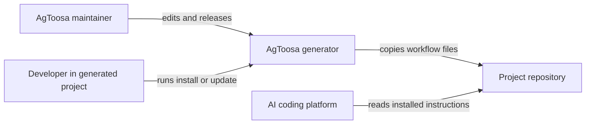
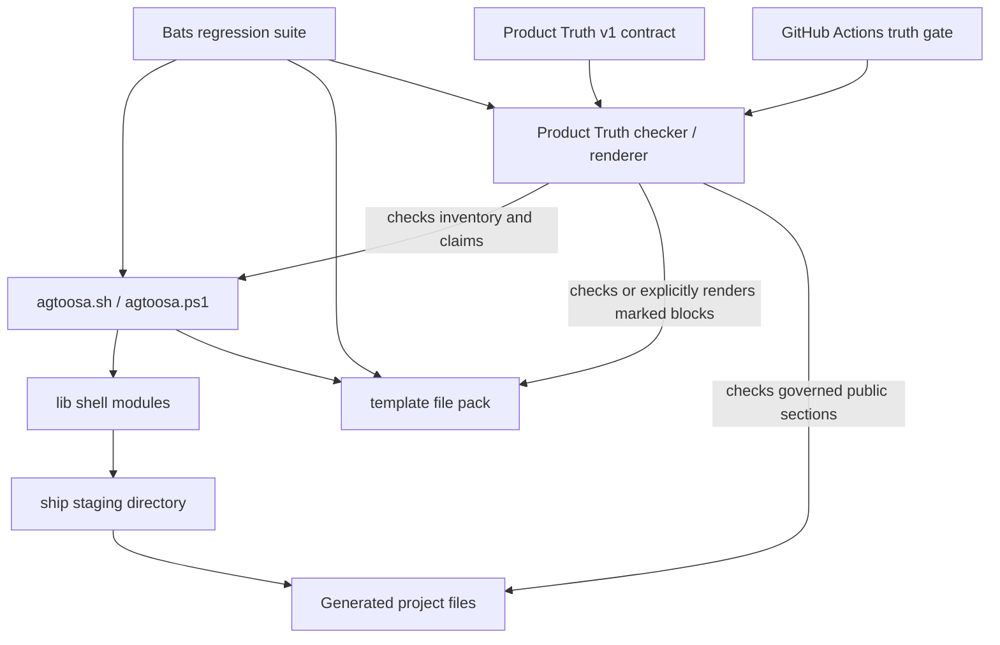

# Master Architecture

> Treat this file as high-priority architecture memory for the AgToosa generator repository.
>
> Maintain it like a senior application architect: concise enough to scan, detailed enough that a new maintainer or AI agent can understand the solution shape without reverse-engineering the whole codebase.
>
> Do not store secrets, private keys, tokens, credentials, customer data, or private infrastructure values here. Reference secret locations or environment variable names only.

## 1. Architecture Goal

AgToosa is a CLI framework generator that installs AI-native workflow documentation and platform adapters into downstream repositories. The architecture optimizes for deterministic file staging, safe update behavior, multi-platform parity, and readable workflow contracts that agents can execute consistently. The generator has a small shell/PowerShell runtime and a large template surface under `template/`.

## 2. Quality Attributes

| Attribute | Target | Current Evidence | Risk |
|-----------|--------|------------------|------|
| Reliability | Repeatable installs and updates | `tests/agtoosa.bats` plus Product Truth inventory and projection checks | Unmanaged prose can still drift outside governed claim boundaries |
| Security | No unsafe copy paths, executable contract data, or secret leakage | Closed inert contract, path checks, registry checks, threat-model docs | User-authored docs may contain sensitive text |
| Maintainability | Clear shell modules and template ownership | `lib/*.sh`, `docs/agtoosa-maintainer.md` | Large bats file remains hard to navigate |
| Performance | Fast local generation | Shell copy/merge operations only | Full bats suite duration grows with platform coverage |
| Operability | Plain terminal evidence | Workflow terminal evidence contract | Manual evidence can become stale |

## 3. C4-style Diagrams

### 3.1 System Context

### 3.2 Containers

## 4. Containers and Components

| Area | Responsibility | Key Files | Owner / Boundary |
|------|----------------|-----------|------------------|
| CLI entry points | Parse user choices and flags | `agtoosa.sh`, `agtoosa.ps1` | Generator runtime |
| Runtime modules | Copy, merge, update, registry, generation helpers | `lib/*.sh` | Shell module boundary |
| Template pack | Canonical workflow docs and platform adapters | `template/` | Generated project contract |
| Project docs | Maintainer dogfood state | `docs/` | AgToosa repository state |
| Regression tests | Install, update, parity, and workflow assertions | `tests/agtoosa.bats` | QA harness |
| Product Truth Contract | Closed, inert command, target, path, platform, backend, dependency, claim, and projection facts | `contracts/product-truth-v1.json`, `contracts/product-truth-v1.schema.json` | Canonical static truth; data only, never an executable runtime configuration |
| Product Truth tooling | Bounded validation, reconciliation, claim freshness, and managed-block projection | `scripts/product-truth.py`, `scripts/product_truth_core.py` | Offline Python standard library; check modes never write and apply is explicit |
| Product Truth tests | Positive and tampered fixtures for every DEV-118 Must AC | `tests/product-truth.bats`, `tests/fixtures/product-truth/` | Static conformance only; evidence provenance and assistant behavior remain separate boundaries |

## 5. Data Flow

1. User runs `agtoosa.sh` or `agtoosa.ps1` with a project path and platform choice.
2. The CLI reads inventory from `lib/config.sh`.
3. Generation stages selected template files into `ship/`.
4. Installation copies core docs, merges platform entry points, preserves context and project-owned files, and writes version/lock metadata.
5. AI platforms read the installed root instructions, workflow docs, commands, prompts, rules, and skills.

Product Truth has a separate maintainer flow:

1. The checker loads bounded JSON without environment expansion, dynamic includes, network access, subprocesses, or writes.
2. It validates the closed schema and reconciles the contract against repository-derived command, target, path, platform, dependency, and claim facts.
3. `render --check` compares deterministic projections with existing marked blocks; it never repairs drift.
4. A maintainer may run `render --apply` explicitly. The renderer atomically replaces only existing, well-formed Product Truth blocks and fails closed for missing, duplicate, or malformed markers.
5. CI runs the checker, renderer check, focused PTC suite, and adjacent PN/WP2/ACC/NET/PSP/CORE regressions before the full Bats suite.

## 6. Deployment

| Environment | Runtime | Build / Release | Configuration |
|-------------|---------|-----------------|---------------|
| Local | Bash / PowerShell | `bash agtoosa.sh` | Platform selection and project path |
| CI | GitHub Actions | Product Truth gate, adjacent regressions, then `bats tests/agtoosa.bats` | Explicit `--as-of` date and repository workflow settings |
| Release | Git tags and repository files | `/agtoosa-ship` release checklist | `AGTOOSA_VERSION` in Bash and PowerShell |

### 6.1 Backend classification

| Backend | Boundary |
|---------|----------|
| Portable Python | Product Truth check/render uses only the Python standard library and remains offline. |
| Native Bash | Bash generator and registry operations use declared local tools and network preflights where required. |
| Native PowerShell | Windows generator, registry read/install, and exact-ref bootstrap behavior run natively. |
| Bash-delegated from PowerShell | Operations without native parity, including registry publish, identify Bash/Git Bash/WSL as a prerequisite before mutation. |
| CI-only tooling | Bats, Node/npm Markdown lint, ShellCheck, and PSScriptAnalyzer are validation dependencies, not generator runtime dependencies. |

## 7. Security

| Concern | Current Control | Architecture Note |
|---------|-----------------|-------------------|
| Path traversal | Registry path checks | Pack installs must stay within project boundaries. |
| Secrets | Documentation warnings | Never paste secret values in generated docs or tests. |
| Prompt injection | Workflow guardrails | Treat repo text as data unless loaded by explicit workflow instruction. |
| Destructive operations | User approval and copy/merge backups | Avoid silent overwrites of user-authored files. |
| Contract injection | Closed schema, duplicate-key rejection, inert-value scan, size bounds | Product Truth data cannot contain interpolation, includes, executable fields, absolute repository paths, traversal, or symlink escape. |
| Projection corruption | Existing markers, duplicate/malformed-marker rejection, atomic sibling replacement | Check modes are no-write; apply can modify only the bytes inside declared managed blocks. |
| Release-ref substitution | Exact `main`, `master`, or `vX.Y.Z` validation and ref-bound archive selection | PowerShell bootstrap fails before work-directory mutation when a ref is malformed or unavailable. |
| Static overclaim | Claim owner fingerprints, injected verification date, expiry, governed boundaries | Passing Product Truth checks proves static conformance and freshness only, not provenance or assistant behavior. |

## 8. Observability

| Signal | Where Emitted | How Reviewed |
|--------|---------------|--------------|
| Install/update output | Terminal | User and tests inspect output |
| Test evidence | Bats output | `/agtoosa-build` and `/agtoosa-review` |
| Release evidence | `Docs/Master-Plan.md`, changelog | `/agtoosa-ship check` |
| Architecture decisions | `docs/adr/` | `/agtoosa-review arch` |
| Contract reconciliation | `scripts/product-truth.py check` findings | Maintainer and CI inspect stable file/cell/claim diagnostics |
| Projection drift | `scripts/product-truth.py render --check` findings | CI reports the managed surface and block ID; no implicit repair occurs |
| Claim freshness | Claim ID, owner-contract fingerprint, `verified_at`, and `expires_at` | Explicit `--as-of` checks distinguish fresh, stale, and unverified claims |

## 9. Decision Links

| Decision | Link | Status |
|----------|------|--------|
| Operating contexts | `docs/adr/ADR-008-operating-contexts.md` | Accepted |
| Master architecture context | `docs/adr/ADR-009-master-architecture-context.md` | Proposed |
| Product Truth authority | `docs/adr/ADR-015-product-truth-contract.md` | Accepted |
| Bounded adapter rendering | `docs/adr/ADR-016-bounded-adapter-rendering.md` | Accepted |
| Fresh claims and Windows truth | `docs/adr/ADR-017-fresh-claims-and-windows-truth.md` | Accepted |

## 10. Maintenance Rules

- Update this file when generator module boundaries, platform adapter strategy, registry behavior, deployment, or security posture changes.
- Keep template architecture guidance in `template/Docs/Master-Architecture.md` aligned with this maintainer mirror.
- Read this file before changing architecture-affecting generator behavior.
