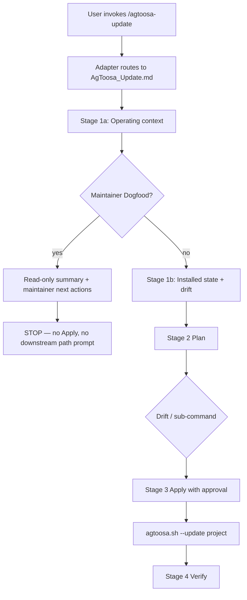

# Spec: DEV-030 — Fix `/agtoosa-update` self-target uncertainty

> **Story ID:** DEV-030
> **Epic:** DEV-002 — Workflow Templates
> **Status:** 🟦 Todo (plan complete — awaiting approval)
> **Estimate:** S _(proposed; confirm at approval)_
> **Spec created:** 2026-05-25

## Context

`/agtoosa-update` correctly delegates file mutation to `agtoosa.sh --update`, and the CLI correctly blocks targeting the AgToosa generator source tree. The gap is in the **agent workflow**: Stage 1 treats every repo like a downstream install, so after detecting maintainer surfaces it still plans CLI Apply and may ask for a “downstream project path” even when the user is already in **Maintainer Dogfood Mode**.

**Root cause:** Operating-context detection is not a first-class Stage 1 outcome. Maintainer signals (`docs/agtoosa-maintainer.md`, `agtoosa.sh`, `lib/`, `template/`) are visible but not wired to an early stop before Plan/Apply.

**Fix direction:** Make generator-repo detection a first-class Stage 1 branch; stop before Apply in the source tree; improve Bash/PowerShell self-target errors with maintainer-safe guidance. No new CLI flags or changed update semantics.

## 1. Requirements

### 1.1 Goal Contract

| Field | Value |
|-------|-------|
| Goal | Eliminate ambiguous `/agtoosa-update` behavior when run inside the AgToosa generator repo by branching on operating context before drift planning. |
| User outcome | Maintainers running `/agtoosa-update` in this repo get a clear stop with maintainer next actions; downstream users still get Detect → Plan → Apply → Verify unchanged. |
| Success condition | Canonical `AgToosa_Update.md` (template + maintainer mirror) documents operating-context detection; Maintainer Dogfood stops before Apply; CLI/PS1 self-target errors cite `docs/agtoosa-maintainer.md` and forbid creating `Docs/` or `.agtoosa-version` here; bats lock the contract. |
| Proof / evidence | Focused bats filter `agtoosa-update|source directory|Maintainer Dogfood|DEV-027|DEV-030` green; extended self-target tests assert actionable guidance. |
| Non-goals | New `--update` flags; maintainer “sync docs mirrors” automation; changing `lib/update.sh` merge semantics; weakening the self-target CLI block. |
| Assumptions | CLI continues to reject self-update of the generator repo. Separate maintainer mirror sync remains manual or a future story. |
| Risks | Agents override the doc and still run Apply; generated-project wording regresses; adapter duplicates conflicting instructions. Mitigate with parity bats and thin adapters. |

### 1.2 User Stories

**As an** AgToosa maintainer, **I want** `/agtoosa-update` to recognize Maintainer Dogfood Mode and stop with clear next actions **so that** I am not prompted to apply a downstream CLI update against the generator repo.

**As a** generated-project user, **I want** `/agtoosa-update` to behave exactly as after DEV-027 **so that** drift detection, approval, CLI Apply, and Verify remain unchanged in downstream installs.

### 1.3 Acceptance Criteria (EARS)

| ID | EARS | Priority |
|----|------|----------|
| AC-001 | WHEN `/agtoosa-update` begins Stage 1 THE SYSTEM SHALL determine operating context (Maintainer Dogfood vs Generated Project) before treating version drift as actionable Apply work | Must |
| AC-002 | WHEN the current repo is the AgToosa source tree (maintainer guide plus generator surfaces such as `agtoosa.sh`, `lib/`, `template/`) THE SYSTEM SHALL classify Maintainer Dogfood Mode | Must |
| AC-003 | WHEN Maintainer Dogfood Mode is detected THE SYSTEM SHALL stop before Apply and SHALL NOT ask for a downstream project path defaulting to the current repo | Must |
| AC-004 | WHEN Maintainer Dogfood Mode is detected THE SYSTEM SHALL report that CLI baseline update via `agtoosa.sh --update` is unavailable for the source tree and SHALL route to maintainer-safe actions: `/agtoosa-status`, `/agtoosa-spec` or `/agtoosa-build` for maintainer stories, or an explicit downstream path that is not the generator repo | Must |
| AC-005 | WHEN Generated Project Mode is detected THE SYSTEM SHALL retain Detect → Plan → ask-then-apply → Apply → Verify per DEV-027 | Must |
| AC-006 | WHEN `agtoosa.sh` or `agtoosa.ps1` blocks self-target THE SYSTEM SHALL preserve nonzero exit and SHALL print concise guidance that `--update` is for downstream installs, the source repo uses `docs/agtoosa-maintainer.md`, and the user must not create `Docs/` or `.agtoosa-version` in the generator tree | Must |
| AC-007 | WHEN platform adapters or skills mention `/agtoosa-update` THE SYSTEM SHALL remain thin routers to the canonical doc and SHALL NOT override the operating-context stop | Must |
| AC-008 | WHEN `tests/agtoosa.bats` runs DEV-030 coverage THE SYSTEM SHALL assert operating-context wording in canonical update docs and maintainer stop-before-Apply behavior | Must |
| AC-009 | WHEN interactive install or `--update` targets the AgToosa root THE SYSTEM SHALL include maintainer guidance in Bash output matching AC-006 | Should |
| AC-010 | WHEN PowerShell blocks self-target THE SYSTEM SHALL include guidance consistent with AC-006 verifiable by static grep in bats | Should |

### 1.4 Out of Scope

- Implementing `agtoosa.sh --sync-maintainer-docs` or automated template→`docs/` mirror sync
- Changing preservation lists, lock-file semantics, or DEV-027 approval/verify gates for downstream projects
- Allowing `--update` on the generator repo
- Network/registry update features

## 2. Design

### 2.1 Architecture Blueprint

| File / area | Change |
|-------------|--------|
| `template/Docs/AgToosa_Update.md` | Restructure Stage 1: **1a Operating context** then **1b Installed state**; add Maintainer Dogfood branch with stop conditions and next actions; keep Generated Project Detect → Plan → Apply → Verify |
| `docs/AgToosa_Update.md` | Maintainer mirror of template changes (`docs/` paths, `docs/agtoosa-maintainer.md` citations) |
| `agtoosa.sh` | Extend self-target error text (install + `--update` paths) with maintainer guidance; no behavior change to block logic |
| `agtoosa.ps1` | Matching self-target guidance strings for install/update blocks |
| `template/.claude/commands/agtoosa-update.md` (and sibling adapters) | Only if needed: one-line pointer that operating context is resolved in canonical doc — no duplicate Apply instructions |
| `template/.codex/skills/agtoosa-update/SKILL.md` | Optional one-line operating-context note; must not weaken DEV-027 contract |
| `tests/agtoosa.bats` | DEV-030 section: doc assertions + extended self-target guidance tests |
| `docs/AgToosa_TestPlan-DEV-030.md` | Created in `/agtoosa-spec tasks` — AC → test mapping |
| `docs/Master-Plan.md` | Backlog row DEV-030 |

**Stage 1 — Operating context (new 1a)**

Detection signals (any strong combination):

| Signal | Maintainer Dogfood | Generated Project |
|--------|-------------------|-------------------|
| `docs/agtoosa-maintainer.md` (or `Docs/` only in downstream) | Present at repo root | Absent |
| `agtoosa.sh` + `lib/` + `template/` at repo root | Present | Absent |
| `docs/Master-Plan.md` charter product = AgToosa | Typical | N/A for generic apps |
| `Docs/.agtoosa-version` | Must **not** be treated as install marker here | Expected when installed |

**Maintainer Dogfood branch outcomes**

| Sub-command | Behavior |
|-------------|----------|
| Full `/agtoosa-update` | Run 1a → brief 1b (read-only) → **stop** with maintainer report; no Apply |
| `check` | Briefing may note dogfood context; still read-only |
| `plan` | Explain why CLI Apply is N/A; list maintainer next actions; **stop** |
| `apply` / default Apply | **Forbidden** — do not invoke `agtoosa.sh --update` on `SCRIPT_DIR` |
| `verify` | Only meaningful for downstream target; in dogfood, redirect to status/spec |

**Maintainer report (required content)**

- Operating context: Maintainer Dogfood Mode
- CLI update: not available for this tree
- Do not create `Docs/` or `.agtoosa-version` here
- Next actions: `/agtoosa-status`; maintainer story via `/agtoosa-spec` / `/agtoosa-build`; or re-run update against an explicit downstream path (not `.`)

**Stage 1b — Installed state (existing DEV-027 detect)**

Runs only when Generated Project Mode is confirmed. Preserves steps 1–9 from DEV-027 (`Docs/.agtoosa-version`, lock, sentinels, Context, Master-Architecture, Master-Plan, changelog, specs, drift).

**CLI guard text (illustrative — exact wording in build)**

```
❌ Error: Target path cannot be the AgToosa source directory itself.
   --update is for downstream installed projects only.
   In the AgToosa generator repo, follow docs/agtoosa-maintainer.md.
   Do not create Docs/ or Docs/.agtoosa-version here.
```

PowerShell: same semantics via `Write-Color` blocks at existing guard sites (~lines 773, 837).

### 2.2 Data Flow



**Failure path (agent ignores doc):** User approves Apply in dogfood → agent runs CLI → CLI blocks self-target (AC-006) → user sees improved message. Workflow doc must prevent reaching this path in the happy case (AC-003).

### 2.3 Threat Model (STRIDE)

| Threat | Category | Mitigation |
|--------|----------|------------|
| Agent runs `--update` on generator repo and corrupts `template/` or maintainer docs | Tampering | AC-003 stop before Apply; AC-006 CLI block preserved |
| Maintainer creates `Docs/` in generator repo, breaking path conventions | Tampering | AC-004/AC-006 explicit “do not create Docs/” guidance |
| Adapter tells agent to sync files by hand in dogfood | Elevation of Privilege | AC-007 thin routing; canonical doc owns behavior |
| User believes update succeeded in dogfood when only briefing ran | Repudiation | AC-004 explicit “CLI unavailable” report |
| Downstream update flow regresses to read-only-only | Denial of Service | AC-005 parity with DEV-027; T-001–T-009 remain valid |
| Self-target error leaks paths from another machine | Information Disclosure | Guidance uses stable doc paths only; no env dumps |

### 2.4 Build Scope

**In scope:** `template/Docs/AgToosa_Update.md`, `docs/AgToosa_Update.md`, `agtoosa.sh`, `agtoosa.ps1`, `tests/agtoosa.bats`, optional adapter one-liners under `template/.claude/`, `.cursor/`, `.gemini/`, `.github/`, `.windsurf/`, `.codex/` for `agtoosa-update` only if grep parity requires it.

**Out of scope:** `lib/update.sh` logic changes, VERSION bump, registry, branch-protection workflow, DEV-029 files except avoiding conflicting edits in shared `tests/agtoosa.bats` hunks.

**Parallelization during `/agtoosa-build`:**

| Wave | Tasks |
|------|-------|
| 1 | Canonical doc updates (template + `docs/` mirror) |
| 2 | CLI/PS1 message strings (independent of docs) |
| 3 | Bats DEV-030 + extend self-target tests |
| 4 | Adapter spot-check only if T-007-style parity fails |

## 3. Tasks

> **Plan phase only.** Run `/agtoosa-spec tasks` to derive the task tree, `docs/Master-Plan.md` → `## Active Tasks`, and `docs/AgToosa_TestPlan-DEV-030.md`.

_Placeholder — not approved for build._

## ✅ Spec Approved

<!-- Append date and approver when user confirms spec approval -->
