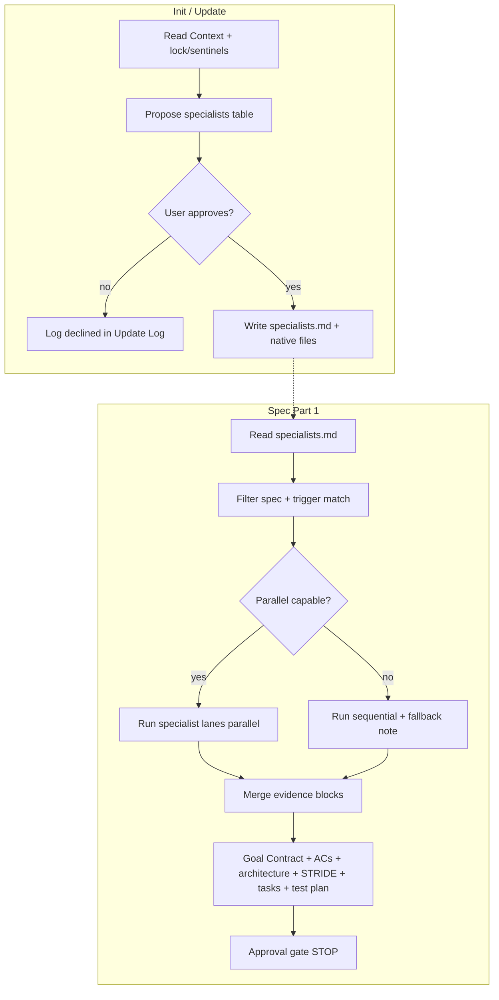

# Spec: DEV-031 — Project-Specific Specialist Subagents

> **Story ID:** DEV-031
> **Epic:** DEV-002 — Workflow Templates
> **Status:** ✅ Done
> **Estimate:** M
> **Spec created:** 2026-05-25

## Context

AgToosa ships fixed lifecycle adapters (`agtoosa-*`) and virtual review personas, but downstream projects often need **repeatable, domain-specific** agent lanes (registry hygiene, bats maintainer, API contract checks, etc.). DEV-008 added Codex-only **project skill** discovery; this story generalizes to **cross-platform v1 specialist subagents** with a single canonical contract and approval-gated materialization.

**User-selected scope (recorded as findings):**

| Decision | Choice |
|----------|--------|
| Story ID | DEV-031 |
| Platform scope | Cross-platform v1 (Codex, Claude, GitHub agents, Cursor, Windsurf, Gemini when installed) |
| Creation model | Project-specific only — no default generic specialist roster in `template/` |
| Discovery | `/agtoosa-init` and agentic `/agtoosa-update` (post-Verify proposal) |
| Spec orchestration | Early Part 1 reads `Docs/Context/specialists.md`; parallel when native delegation exists, else sequential with fallback note |
| CLI | No new flag; `agtoosa.sh --update` unchanged; never overwrite approved specialist artifacts |

**Smart interview findings (gaps covered without additional questions):**

| Checklist area | Finding |
|----------------|---------|
| Status quo | Init Phase E is **Project Skill Discovery (Codex only)**; Review runs four **virtual** personas on Claude; no `AgToosa_Specialists.md` or `specialists.md` today |
| Narrowest v1 | Contract doc + init/update/spec orchestration + `lib/config.sh` install list + bats; no runtime supervisor |
| Failure modes | Silent roster writes; `agtoosa-*` shadowing; secret paste into specialist bodies; CLI clobbering project files; parallel lanes without evidence blocks |
| Security | Local file generation only; MCP/tool fields declared but secrets redacted; approval before any write |
| Test evidence | Template inventory + grep contracts + parity adapter refs + full bats regression |
| Rollout | New canonical doc installed on `--update`; existing projects gain discovery on next init/update/spec |
| ID hygiene | Prior backlog row “DEV-031 DEV-029 review/ship” renumbered to **DEV-032** to free DEV-031 for this story |

## 1. Requirements

### 1.1 Goal Contract

| Field | Value |
|-------|-------|
| Goal | Add cross-platform v1 support for **project-specific specialist subagents** discovered and materialized only when repo context justifies them and the user explicitly approves. |
| User outcome | Maintainers and generated-project users get optional specialist lanes during spec (and discovery during init/update) without shipping a generic specialist pack or colliding with `agtoosa-*` workflows. |
| Success condition | `template/Docs/AgToosa_Specialists.md` defines the contract; init/update/spec workflows implement discovery, approval, orchestration, and CLI non-overwrite rules; `lib/config.sh` installs the canonical doc; bats lock inventory, grep guardrails, no default roster in template, and adapter routing. |
| Proof / evidence | Focused bats filter green; full `tests/agtoosa.bats` green; test plan `docs/AgToosa_TestPlan-DEV-031.md` maps ACs to test IDs. |
| Non-goals | Default specialist roster in template; new `agtoosa.sh` flags; remote specialist marketplace; auto-run `/agtoosa-build` after spec; specialist phase hooks for build/review/qa in v1 (unless explicitly added during build — default out). |
| Assumptions | Platforms without true subagents use sequential lanes with identical evidence schema; Story Skill Opportunity Synthesis remains separate from specialist materialization (both approval-gated). |
| Risks | Duplication with DEV-008 “skills” terminology; adapter drift; agents skip fallback notes. Mitigate with distinct glossary in `AgToosa_Specialists.md` and parity bats. |

### 1.2 User Stories

**As an** AgToosa user running `/agtoosa-init`, **I want** the framework to propose only reusable project-specific specialists for my installed platforms **so that** I can approve a roster and native artifacts without receiving a generic pack.

**As an** AgToosa user running `/agtoosa-update`, **I want** a read-only specialist compatibility check and an optional post-Verify materialization proposal **so that** baseline CLI update never overwrites my approved specialist files.

**As an** AgToosa user running `/agtoosa-spec`, **I want** matching approved specialists to contribute structured evidence into the spec **so that** Goal Contract, ACs, architecture, threat model, tasks, and test plan reflect domain expertise.

**As an** AgToosa maintainer, **I want** bats and `lib/config.sh` to treat `AgToosa_Specialists.md` as an owned workflow doc **so that** installs and updates stay consistent across generator releases.

### 1.3 Acceptance Criteria (EARS)

| ID | EARS | Priority |
|----|------|----------|
| AC-001 | WHEN AgToosa installs or updates workflow docs THE SYSTEM SHALL include `Docs/AgToosa_Specialists.md` from the template pack via `lib/config.sh` `DOCS_FILES` | Must |
| AC-002 | WHEN `Docs/AgToosa_Specialists.md` is present THE SYSTEM SHALL define specialist candidate fields: `id`, `trigger`, `purpose`, `phase_hooks`, `inputs`, `tools/MCP needs`, `custom_mode`, `outputs`, `validation`, `safety_notes`, and per-platform native target paths | Must |
| AC-003 | WHEN `/agtoosa-init` runs Project Specialist Discovery THE SYSTEM SHALL detect installed platforms from lock metadata and sentinels, propose only project-specific reusable specialists, and require explicit approval before writing `Docs/Context/specialists.md` or native specialist files | Must |
| AC-004 | WHEN a specialist candidate is proposed THE SYSTEM SHALL reject ids named `agtoosa-*`, one-off story tasks, duplicates, unvalidated candidates, and content bearing secret values | Must |
| AC-005 | WHEN a specialist is approved THE SYSTEM SHALL materialize native artifacts only at declared targets: `.codex/skills/<id>/SKILL.md`, `.claude/skills/<id>.md`, `.github/agents/<id>.agent.md`, and platform fallback rule/workflow files for Cursor, Windsurf, and Gemini when those platforms are installed | Must |
| AC-006 | WHEN `agtoosa.sh --update` runs THE SYSTEM SHALL NOT register or overwrite generated project-specific specialist files as template inventory | Must |
| AC-007 | WHEN agentic `/agtoosa-update` completes Verify THE SYSTEM MAY propose specialist materialization as a separate approval step and SHALL NOT apply specialist writes during baseline CLI update | Must |
| AC-008 | WHEN `/agtoosa-update check` or `plan` runs THE SYSTEM SHALL include a read-only Specialist Compatibility Check reporting missing or stale specialist support | Must |
| AC-009 | WHEN `/agtoosa-spec` Part 1 begins THE SYSTEM SHALL read `Docs/Context/specialists.md` when present and run only specialists whose `phase_hooks` includes `spec` and whose `trigger` matches the active story | Must |
| AC-010 | WHEN a specialist lane completes THE SYSTEM SHALL emit a structured evidence block: findings, files read, commands, warnings/errors, recommendations, and spec sections affected | Must |
| AC-011 | WHEN the host supports native parallel subagent delegation THE SYSTEM SHALL run matching spec-phase specialists in parallel; OTHERWISE THE SYSTEM SHALL run the same lanes sequentially and record an explicit fallback note in spec output | Must |
| AC-012 | WHEN the spec orchestrator merges specialist evidence THE SYSTEM SHALL update Goal Contract, ACs, architecture, STRIDE threat model, task tree, and test plan skeleton before the existing approval gate | Must |
| AC-013 | WHEN `template/` is shipped THE SYSTEM SHALL NOT include a default project specialist roster or generic specialist skill/agent files (only AgToosa lifecycle adapters) | Must |
| AC-014 | WHEN platform adapters reference specialists THE SYSTEM SHALL route to `Docs/AgToosa_Specialists.md` without duplicating full discovery/orchestration logic | Must |
| AC-015 | WHEN `tests/agtoosa.bats` runs DEV-031 coverage THE SYSTEM SHALL assert canonical doc inventory, init/update/spec contracts, reserved-name guard, MCP/tool fields, platform targets, secret redaction wording, and adapter parity | Must |

**Failure modes (Must ACs):**

| AC | Failure mode |
|----|--------------|
| AC-001 | Specialists doc missing after install/update; downstream agents invent ad hoc specialist rules |
| AC-003 | Init writes `specialists.md` or native files without approval |
| AC-004 | `agtoosa-qa-specialist` shadows `/agtoosa-qa`; secrets copied into specialist SKILL bodies |
| AC-006 | `--update` deletes or replaces `.codex/skills/my-specialist/` |
| AC-009 | Spec ignores roster; runs all specialists regardless of trigger |
| AC-010 | Parallel lanes return prose only; orchestrator cannot merge into AC tables |
| AC-011 | Claude/Cursor hosts claim parallel without fallback note when only sequential is possible |
| AC-013 | Template ships `template/Docs/Context/specialists.md` with default personas |
| AC-014 | Each adapter re-implements discovery tables diverging from canonical doc |

### 1.4 Out of Scope

- Shipping curated specialist packs (security-auditor, etc.) inside `template/`
- Specialist orchestration for `/agtoosa-build`, `/agtoosa-qa`, or `/agtoosa-review` (follow-up unless build explicitly extends hooks)
- New CLI subcommands or flags
- Remote specialist registry download
- Replacing virtual review personas in `AgToosa_Review.md`

## 2. Design

### 2.1 Architecture Blueprint

| File / area | Change |
|-------------|--------|
| `template/Docs/AgToosa_Specialists.md` | **New** canonical contract (fields, glossary vs skills, platform matrix, evidence schema, approval gates) |
| `template/Docs/AgToosa_Init.md` | Replace Phase E **Project Skill Discovery** framing with **Project Specialist Discovery** (cross-platform); keep skill synthesis cross-ref or subsection per DEV-008 |
| `template/Docs/AgToosa_Update.md` | Add **Specialist Compatibility Check** (read-only in check/plan); post-Verify optional materialization with separate approval |
| `template/Docs/AgToosa_Spec.md` | Add **Spec Specialist Orchestration** early in Part 1; merge contract; parallel/sequential rules |
| `template/Docs/AgToosa_Agent.md` | Specialist lifecycle, terminal evidence requirements, routing table |
| `template/Docs/AgToosa_Skills.md` | Distinguish workflow skills vs project specialists; platform capability matrix |
| `lib/config.sh` | Add `Docs/AgToosa_Specialists.md` to `DOCS_FILES`; do **not** add generated `Context/specialists.md` or project specialist paths to template inventory |
| `docs/AgToosa_*.md` | Maintainer mirrors where story touches mirrored workflows (build step) |
| `template/.codex/skills/agtoosa-*/`, `.claude/commands/`, `.cursor/commands/`, `.github/prompts/`, `.gemini/commands/`, `.windsurf/workflows/` | Thin pointers to canonical doc only if parity bats fail |
| `tests/agtoosa.bats` | DEV-031 section (inventory, grep, no-default-roster, adapter refs) |
| `docs/AgToosa_TestPlan-DEV-031.md` | AC → test mapping |
| `docs/adr/ADR-010-project-specific-specialists.md` | Accepted when story ships |
| `docs/Master-Plan.md` | Backlog DEV-031; renumber prior DEV-031 chore → DEV-032 |

**Glossary (canonical doc must state):**

| Term | Meaning |
|------|---------|
| Workflow adapter | Installed `agtoosa-*` command/skill — AgToosa-owned, always present after install |
| Project skill | DEV-008 artifact under `.codex/skills/` for repeatable **commands** (may overlap; prefer one artifact type per concern) |
| Project specialist | Approval-gated subagent lane with `phase_hooks`, evidence block, multi-platform native files |
| Virtual specialist | Built-in review personas (Security, EM, CEO, QA) — not project-specific |

**Approved roster (`Docs/Context/specialists.md`) — illustrative schema:**

```yaml
# Created only after user approval. Not shipped in template/.
version: 1
specialists:
  - id: registry-pack-auditor
    trigger: "story touches registry or pack-queue"
    phase_hooks: [spec, review]
    platforms: [codex, claude, github]
    approved: 2026-05-25
```

**Evidence block (required shape for AC-010):**

```markdown
### Specialist evidence: <id>
- **Findings:** …
- **Files read:** …
- **Commands:** …
- **Warnings/errors:** …
- **Recommendations:** …
- **Spec sections affected:** Goal Contract | ACs | Architecture | Threat model | Tasks | Test plan
```

**Platform capability matrix (v1):**

| Platform | Native target | Parallel spec lanes |
|----------|---------------|---------------------|
| Codex | `.codex/skills/<id>/SKILL.md` | When host supports delegated agents |
| Claude Code | `.claude/skills/<id>.md` + Agent tool | Yes (native) |
| GitHub Copilot | `.github/agents/<id>.agent.md` | Per host |
| Cursor | `.cursor/rules/<id>.mdc` or workflow fallback | Sequential default |
| Windsurf | `.windsurf/workflows/<id>.md` fallback | Sequential default |
| Gemini | `.gemini/commands/<id>.toml` fallback | Sequential default |

### 2.2 Data Flow



**CLI update path:** `agtoosa.sh --update` copies only `DOCS_FILES` and template inventory — never project `specialists.md` or `.codex/skills/<project-id>/`.

### 2.3 Threat Model (STRIDE)

| Threat | Category | Mitigation |
|--------|----------|------------|
| Specialist skill exfiltrates `.env` into SKILL.md | Information Disclosure | AC-004 secret rejection; safety_notes; path-only references |
| Rogue `agtoosa-build-specialist` overrides lifecycle command | Spoofing | AC-004 reserved `agtoosa-*` guard |
| `--update` merges away custom specialist | Tampering | AC-006 inventory exclusion; AC-007 separate approval |
| Parallel lane race corrupts spec sections | Tampering | AC-010 structured blocks; orchestrator merge order documented |
| User believes specialists installed by default | Repudiation | AC-013 no template roster; init approval table |
| MCP tools declared without user consent | Elevation of Privilege | AC-002 tools/MCP field + approval gate |
| Spec runs specialists without trigger match | Denial of Service | AC-009 trigger filter |

## Build Scope

```
✅ Ready to proceed — Scope Boundary
Files in scope      : template/Docs/AgToosa_Specialists.md (new), template/Docs/AgToosa_Init.md, AgToosa_Update.md, AgToosa_Spec.md, AgToosa_Agent.md, AgToosa_Skills.md, lib/config.sh, tests/agtoosa.bats, docs/AgToosa_TestPlan-DEV-031.md, docs/adr/ADR-010-project-specific-specialists.md
Directories in scope: template/.codex/skills/agtoosa-* (thin routing only), template/.claude/, template/.cursor/, template/.github/, template/.gemini/, template/.windsurf/ (adapter spot-check)
Out of scope        : Default specialists in template/Docs/Context/, lib/update.sh merge changes for project files, new CLI flags, build/qa/review specialist hooks (v1), VERSION bump until ship
```

## 3. Tasks

### 3.1 Task Tree

- [x] **1.** Canonical specialist contract
  - [x] 1.1 Author `template/Docs/AgToosa_Specialists.md` (fields, evidence schema, platform matrix, glossary, secret rules) — _AC-002, AC-010, AC-011_
  - [x] 1.2 Add `Docs/AgToosa_Specialists.md` to `lib/config.sh` `DOCS_FILES` — _AC-001, AC-006_
  - [x] 1.3 Mark ADR-010 Accepted when implementation matches — _AC-002_
- [x] **2.** Init workflow — Project Specialist Discovery
  - [x] 2.1 Replace/extend Phase E in `template/Docs/AgToosa_Init.md` (platform detect, proposal table, approval, materialization paths) — _AC-003, AC-004, AC-005_
  - [x] 2.2 Cross-reference DEV-008 skill synthesis without conflating terminology — _AC-004_
- [x] **3.** Update workflow — Specialist Compatibility Check
  - [x] 3.1 Add read-only check/plan section to `template/Docs/AgToosa_Update.md` — _AC-008_
  - [x] 3.2 Document post-Verify optional materialization + separate approval; CLI non-overwrite — _AC-006, AC-007_
- [x] **4.** Spec workflow — Specialist orchestration
  - [x] 4.1 Add Spec Specialist Orchestration to `template/Docs/AgToosa_Spec.md` (read roster, filter, parallel/sequential, merge, stop at approval gate) — _AC-009, AC-010, AC-011, AC-012_
  - [x] 4.2 Update `template/.codex/skills/agtoosa-spec/SKILL.md` execution contract to reference specialists doc — _AC-014_
- [x] **5.** Agent + Skills documentation
  - [x] 5.1 Update `template/Docs/AgToosa_Agent.md` and `AgToosa_Skills.md` (lifecycle, MCP declaration, terminal evidence) — _AC-002, AC-014_
- [x] **6.** Platform adapter parity (conditional)
  - [x] 6.1 Updated `agtoosa-init` and `agtoosa-update` Codex skills — _AC-014_
- [x] **7.** Maintainer mirrors
  - [x] 7.1 Mirror changed workflow docs to `docs/` with `docs/` path conventions — _AC-001, AC-014_
- [x] **8.** Regression coverage
  - [x] 8.1 DEV-031 bats: inventory, init/update/spec grep, no default roster, adapter refs — _AC-013, AC-015_
  - [x] 8.2 Focused filter then full `tests/agtoosa.bats` — _AC-015_
  - [x] 8.3 Record results in `docs/AgToosa_TestPlan-DEV-031.md` — _AC-015_

### 3.2 Wave Plan

**Wave 1 (parallel):** 1.1, 1.2, 2.1, 3.1, 4.1  
**Wave 2 (sequential after Wave 1):** 3.2, 4.2, 5.1  
**Wave 3 (conditional after Wave 2):** 6.1  
**Wave 4 (sequential after Wave 2/3):** 7.1, 8.1, 8.2, 8.3, 1.3

### 3.3 Test Plan

Test plan: `docs/AgToosa_TestPlan-DEV-031.md`

## Story Skill Opportunity Synthesis

| Skill name | Trigger | Purpose | Decision |
|------------|---------|---------|----------|
| `agtoosa-spec` (existing) | `/agtoosa-spec` | Lifecycle spec workflow | **Update existing** — execution contract only (task 4.2) |
| `registry-pack-auditor` (example) | registry stories | Domain specialist | **Do not generate** at spec time — belongs to init discovery on real projects, not maintainer repo |
| `specialist-orchestrator-helper` | n/a | Duplicate of canonical doc | **Do not generate** |

No new `.codex/skills/` files in the AgToosa maintainer repo for this story unless the user explicitly requests a maintainer-only test fixture during build.

## ✅ Spec Approved

Approved: 2026-05-25 15:31
