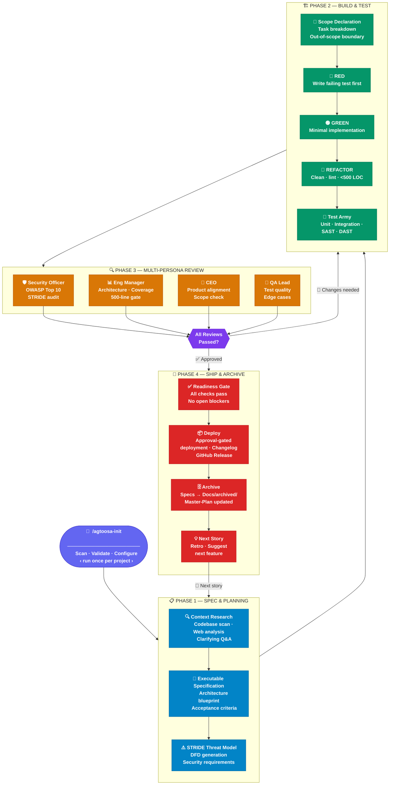

# AgToosa Architecture Overview

> Deep dive for the 4-phase lifecycle. For a 30-second overview, see the [README lifecycle diagram](../README.md#lifecycle-at-a-glance).

AgToosa organizes development into **4 core phases**, executed via slash commands. Every feature follows the same lifecycle — from research to deployment — with mandatory review gates and a continuous loop back to the next story.

| Phase | Command | What It Does |
|-------|---------|-------------|
| **0. Setup** | `/agtoosa-init` | **One-time:** Scan codebase, validate AI configs, establish context |
| **1. Spec & Planning** | `/agtoosa-spec` | Research, specify, architect, STRIDE threat model, and atomic task planning. Generated spec files follow `Docs/SPEC-FORMAT.md` (EARS acceptance criteria, hierarchical task tree, Wave Plan). |
| **2. Build & Test** | `/agtoosa-build` | TDD Red-Green-Refactor against the planned task list → full test army |
| **3. Multi-Persona Review** | `/agtoosa-review` | Security · Architecture · Product · QA review gate |
| **4. Ship & Cleanup** | `/agtoosa-ship` | Deploy, archive, changelog, suggest next story |

## Related docs

- [README](../README.md) — short onboarding
- [README reference](readme-reference.md) — install matrix, commands, security tables
- [Enforcement comparison](../enforcement-comparison.md) — guided vs evidenced vs enforced
- [Phase lifecycle (wiki)](https://github.com/sky2464/AgToosa/wiki/Phase-Lifecycle)
